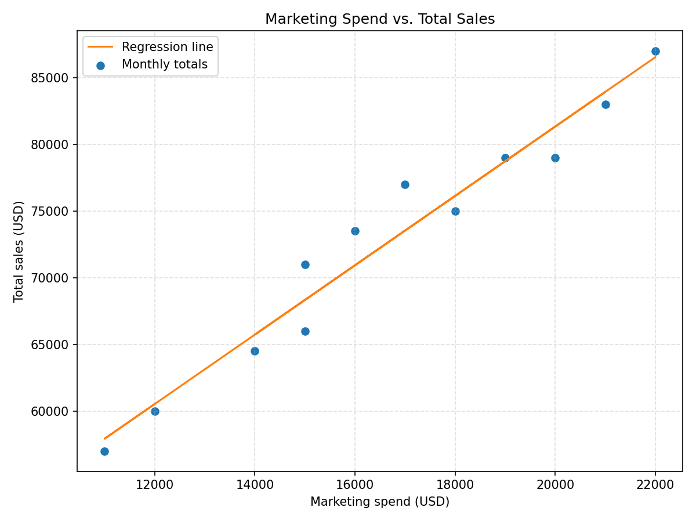

# Coffee Chain Sales Analysis

## Key Metrics
- Average monthly marketing spend: $16,666.67
- Average monthly online sales: $40,416.67
- Average monthly in-store sales: $32,250.00
- Average monthly total sales: $72,666.67
- Median monthly total sales: $74,250.00
- Standard deviation of total sales: $9,230.22

## Relationship Between Marketing and Sales
- Pearson correlation between marketing spend and total sales: 0.977. Values close to 1 indicate a strong positive relationship.
- Simple linear regression of total sales on marketing spend yields a slope of 2.60 and intercept of $29,366.83. Every additional dollar of marketing spend is associated with the slope amount in sales.

## Month-over-Month Growth
- 2023-01 to 2023-02: -5.0% change in total sales
- 2023-02 to 2023-03: 15.8% change in total sales
- 2023-03 to 2023-04: -2.3% change in total sales
- 2023-04 to 2023-05: 16.3% change in total sales
- 2023-05 to 2023-06: 5.3% change in total sales
- 2023-06 to 2023-07: 5.1% change in total sales
- 2023-07 to 2023-08: -4.8% change in total sales
- 2023-08 to 2023-09: -2.5% change in total sales
- 2023-09 to 2023-10: -4.5% change in total sales
- 2023-10 to 2023-11: -3.4% change in total sales
- 2023-11 to 2023-12: 22.5% change in total sales

- Highest growth occurred in 2023-12 with a 22.5% increase over the prior month.

## Online Sales Share
- Average online sales share of total revenue: 55.5%
- Highest online share observed in 2023-06 at 57.0%

## Visualizations

## Interactive Visualizations

  <section class="chart-card">
    <h3>Monthly Total Sales</h3>
    <canvas id="totalSalesChart"></canvas>
  </section>
  <section class="chart-card">
    <h3>Sales Breakdown by Channel</h3>
    <canvas id="channelBreakdownChart"></canvas>
  </section>
  <section class="chart-card">
    <h3>Marketing Spend vs. Total Sales</h3>
    <canvas id="marketingScatterChart"></canvas>
  </section>

